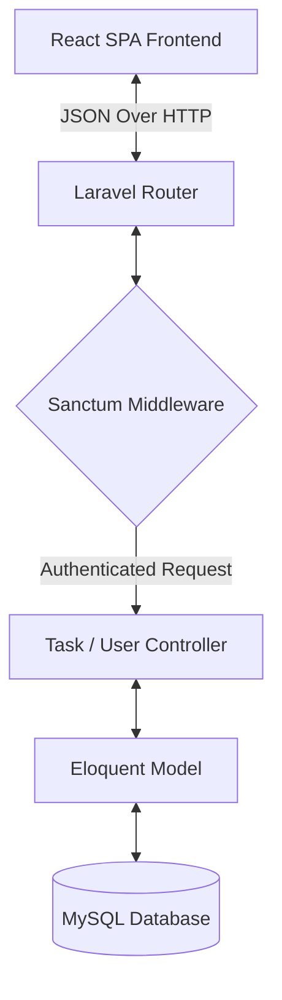

# 📋 Full-Stack Task Management Application (Todo App)

A modern, responsive, full-stack task management application with a secure token-based authentication system, real-time filtering, inline task status editing, and a light/dark mode theme toggler.

---

[](https://laravel.com)
[](https://react.dev)
[](https://mysql.com)
[](https://laravel.com/docs/11.x/sanctum)
[](https://axios-http.com)
[](https://vite.dev)
[](https://git-scm.com)

---

## 🔍 Project Overview

This project is a multi-tier web application consisting of a robust RESTful API built with **Laravel** and a highly responsive, modern user interface built with **React** and **Vite**. The application allows users to register, log in, create tasks, edit tasks, dynamically update status inline from their dashboard, and filter lists based on title/description search, status, and custom date ranges. It is styled with clean glassmorphic effects and provides a global toggle to shift seamlessly between light and dark modes.

---

## ✨ Features

- 🔐 **Secure Authentication**: Token-based authentication using **Laravel Sanctum**. Tokens and user profiles persist in `localStorage`.
- 🛡️ **Protected Routing**: React Router guards that block access to task pages for unauthenticated visitors.
- 📝 **Full CRUD Operations**: Users can create, view, modify, and delete tasks.
- ⚙️ **Inline Status Updates**: Dropdowns on each task card allow users to update the status (`To Do`, `In Progress`, `done`) instantly without loading a separate page.
- 🔍 **Advanced Dynamic Filtering**:
  - Filter by **Status** (All, To Do, In Progress, Done)
  - Search by **Keyword** (Wildcard checks on title and description)
  - Filter by **Date Ranges** (Tasks starting on/after, ending on/before, or between two dates)
- 🌓 **Global Theme Toggler**: Instant transition between a clean light theme and a glassmorphic dark theme, with preferences cached locally.
- 📱 **Fully Responsive Layout**: Built with custom media-queries to ensure standard usability on smartphones, tablets, and desktop monitors.

---

## 🛠️ Tech Stack

### Backend
- **Framework**: Laravel 13.x (PHP 8.3+)
- **Security**: Laravel Sanctum (Token authentication)
- **Database**: MySQL

### Frontend
- **Framework/Runtime**: React 19.x & Vite 8.x
- **Routing**: React Router DOM 7.x
- **HTTP Client**: Axios (with authorization interceptors)
- **Styling**: Vanilla CSS

---

## 🏛️ Architecture

The app is built on a clean decoupled architecture:



1. **Frontend Client**: The React client stores the Sanctum token in `localStorage`. An Axios request interceptor attaches the token to the `Authorization: Bearer` header on all API calls.
2. **Backend API**: The Laravel API intercepts requests, authenticates them via Sanctum, validates inputs, and filters tasks directly on the database level using Eloquent query builders.

---

## 📁 Project Structure

```
todo_app/
├── todo_back/               # Laravel Backend API
│   ├── app/
│   │   ├── Http/
│   │   │   └── Controllers/
│   │   │       ├── Controller.php
│   │   │       ├── TaskController.php
│   │   │       └── UserController.php
│   │   └── Models/
│   │       ├── Task.php
│   │       └── User.php
│   ├── database/
│   │   └── migrations/      # Table definitions (users, tasks, etc.)
│   ├── routes/
│   │   └── api.php          # API routes
│   └── .env                 # Environment configuration
└── todo_front/              # React Frontend (Vite)
    ├── src/
    │   ├── context/
    │   │   └── AuthContext.jsx
    │   ├── ProtectedRoute/
    │   │   ├── Form.jsx     # Add Task Page
    │   │   ├── Home.jsx     # Task List, Filtering & Status Updates
    │   │   └── Modify.jsx   # Edit Task Page
    │   ├── services/
    │   │   └── api.js       # Axios client & request Interceptors
    │   ├── App.jsx          # Routes & global Theme Toggler
    │   ├── index.css        # Theme variables & glassmorphic styles
    │   ├── Login.jsx        # Login Form
    │   ├── Register.jsx     # Register Form
    │   └── main.jsx         # App Entry
    └── package.json
```

---

## 🚀 Installation & Configuration

### Prerequisites
- [PHP](https://www.php.net/downloads) (>= 8.3)
- [Composer](https://getcomposer.org/)
- [Node.js](https://nodejs.org/) (with NPM)
- [MySQL Server](https://dev.mysql.com/downloads/installer/)

---

### Backend Setup (`todo_back`)

1. Navigate to the backend directory:
   ```bash
   cd todo_back
   ```

2. Install dependencies:
   ```bash
   composer install
   ```

3. Create your `.env` configuration file:
   ```bash
   cp .env.example .env
   ```

4. Configure your database connection in `.env`:
   ```env
   DB_CONNECTION=mysql
   DB_HOST=127.0.0.1
   DB_PORT=3306
   DB_DATABASE=todo_back
   DB_USERNAME=your_username
   DB_PASSWORD=your_password
   ```

5. Generate the application key:
   ```bash
   php artisan key:generate
   ```

6. Run migrations:
   ```bash
   php artisan migrate
   ```

7. Start the Laravel development server:
   ```bash
   php artisan serve
   ```
   *The server runs by default at `http://127.0.0.1:8000`.*

---

### Frontend Setup (`todo_front`)

1. Navigate to the frontend directory:
   ```bash
   cd ../todo_front
   ```

2. Install dependencies:
   ```bash
   npm install
   ```

3. Start the Vite local server:
   ```bash
   npm run dev
   ```
   *The client application runs at `http://localhost:5173`.*

---

## 🔌 API Endpoints

### Public Endpoints
| HTTP Method | Route | Description |
| :--- | :--- | :--- |
| `POST` | `/api/register` | Register a new user account |
| `POST` | `/api/login` | Log in and receive a plainText auth token |

### Protected Endpoints (Requires `Authorization: Bearer <token>`)
| HTTP Method | Route | Query Parameters | Description |
| :--- | :--- | :--- | :--- |
| `GET` | `/api/tasks` | `statut`, `search`, `start_date`, `end_date` | Retrieve tasks with optional filtering |
| `POST` | `/api/tasks` | None | Create a new task |
| `GET` | `/api/tasks/{id}` | None | Get specific task details |
| `PUT` | `/api/tasks/modifiy/{id}` | None | Modify a task's title, description, or due date |
| `PUT` | `/api/tasks/{id}/statut` | None | Change status of a task (`To Do`, `In Progress`, `done`) |
| `DELETE` | `/api/tasks/remove/{id}`| None | Remove a task |
| `POST` | `/api/logout` | None | Revoke the current access token and log out |

---

## 🔐 Authentication Flow

1. **Sign Up / Log In**: User sends credentials to `/api/register` or `/api/login`.
2. **Token Generation**: Laravel generates an API token via Sanctum and returns it alongside the User model.
3. **Session Persistence**: The frontend React app catches this token in the `AuthContext` and stores it inside `localStorage`.
4. **Axios Interceptor**: Subsequent HTTP calls automatically embed the token:
   ```javascript
   api.interceptors.request.use((config) => {
       const token = localStorage.getItem('token')
       if (token) {
           config.headers.Authorization = `Bearer ${token}`
       }
       return config;
   })
   ```
5. **Session Termination**: Logging out deletes the token from `localStorage` and revokes the token from the backend database.

---

## 🖼️ Screenshots

*Placeholders for screenshots showing Light Theme, Dark Theme, and Interactive Filter Panel:*

| Light Theme Dashboard | Dark Theme Dashboard |
| :---: | :---: |
|  |  |

| Filter Panel Controls | Task Actions & Inline Status Dropdowns |
| :---: | :---: |
|  |  |

---

## 🔮 Future Improvements

- [ ] **Pagination & Infinite Scroll**: Paginate long task logs on the database side for faster loading times.
- [ ] **Email Alerts**: Send automated email notifications when tasks approach their due date.
- [ ] **Task Categorization**: Support labels/tags for categorizing tasks.
- [ ] **Data Export**: Export task schedules to Excel, CSV, or PDF formats.

---

## 💡 Lessons Learned

- **Decoupled Filter Logic**: Performing filters server-side is far more memory-efficient and scalable than downloading full datasets and running filter rules inside React hooks.
- **Dynamic CSS Variables**: Re-declaring the values of CSS properties in global variables under `.dark` enables theme toggling with zero lines of Javascript layout re-renders.
- **Interceptors for Auth Security**: Centralizing the addition of API bearer headers inside Axios interceptors avoids repetitive auth headers across individual React pages.

---

## 📄 License

This application is open-sourced software licensed under the [MIT License](https://opensource.org/licenses/MIT).

---

## ✍️ Author

- **Workspace Corpus**: `nadiabenslt/todo_app`
